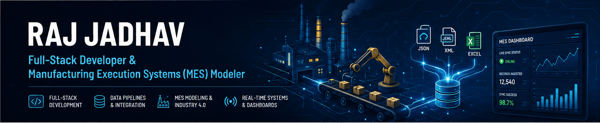

  

<!-- <h1 align="center">Hi 👋, I'm Raj Jadhav</h1>

<h3 align="center">
  Full-Stack Developer & Manufacturing Execution Systems (MES) Modeler
</h3>  -->

  
  
  

---

💼 Current Role: Full-Stack Developer & MES Modeler with over 2.5 years of experience, designing and implementing logic for Critical Manufacturing Execution Systems.

🚀 Background: Strong foundation in full-stack web engineering, software architecture design, and MERN Stack development.

🔭 Latest Project: Built a real-time TC-to-MES Data Ingestion Pipeline & Monitoring Dashboard using Node.js, Express, React, MongoDB, and Socket.io for PLM & industrial data synchronization.

🌱 Learning Lab: Diving deep into advanced data structures & algorithms, Redux Toolkit, and scalable microservices architecture.

👯 Collaboration: Open to contributing to Open-Source MERN projects, industrial automation workflows, and high-performance web applications.

💬 Ask me about: Full-Stack Development, React, Backend Architecture, Socket.io, or how MES modeling optimizes manufacturing workflows.

📫 Reach me at: rajsatishjadhav9@gmail.com

<h3 align="left">Connect with me:</h3>

<h3 align="left">Featured Project:</h3>

  📌 <strong><a href="https://github.com/rajjadhav20/PLM_MES_Pipeline_01">TC-to-MES Data Ingestion Pipeline</a></strong>: Real-time MERN ETL pipeline that ingests PLM data (JSON, XML, Excel), validates schema, and streams live sync logs to an MES dashboard via WebSockets.

<h3 align="left">Languages and Tools:</h3>

 
 
 
 
 
 
 
 
 
 
 
 
 
 

